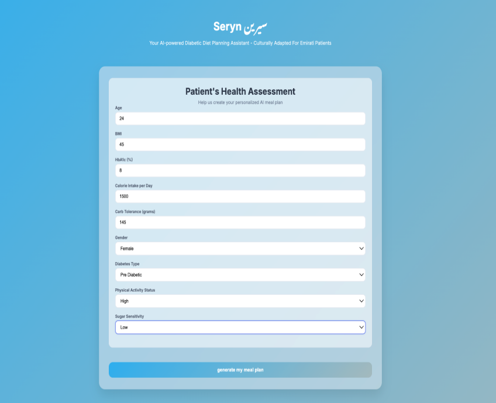
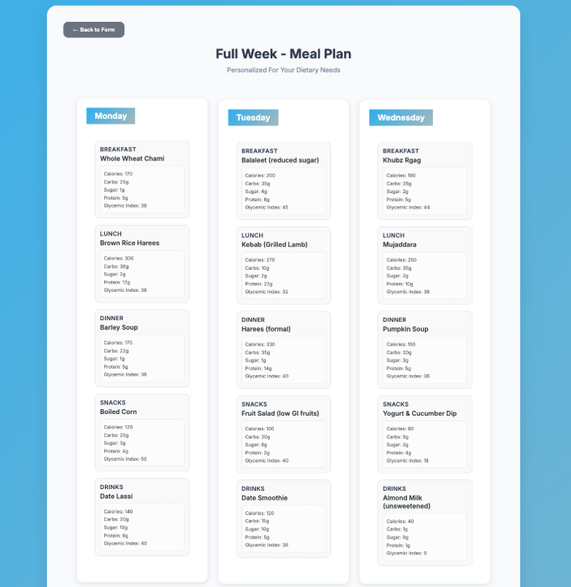
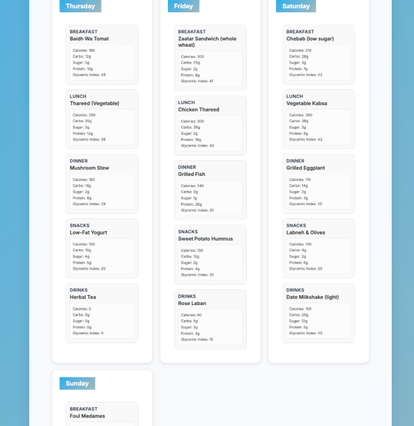

# Seryn Meal Planner

Seryn is a Flask-based web application that generates a personalized 7-day meal plan for diabetic or pre-diabetic users, with meal suggestions adapted to Emirati dietary preferences.

## Problem Definition

Type 2 diabetes meal planning is constrained by multiple factors:

- Glycemic and nutrition constraints
- Individual preferences and adherence
- Cultural acceptability of foods
- Weekly-level planning consistency (not one-off meal suggestions)

Seryn targets this as a constrained recommendation/generation problem, with emphasis on Emirati dietary context.

## Technical Scope
- Build a repeatable pipeline for weekly diet plan generation.
- Support culturally relevant recommendations.
- Preserve machine-readable output for downstream UI/analysis.

## Features

- Collects patient health inputs such as age, BMI, HbA1c, calorie needs, carb tolerance, diabetes type, activity level, and sugar sensitivity.
- Uses separate machine learning models for `Breakfast`, `Lunch`, `Dinner`, `Snacks`, and `Drinks`.
- Builds a full weekly meal plan with 7 recommendations for each meal category.
- Shows nutritional details for each recommended dish using the local `output.json` metadata file.
- Includes a landing page and a dedicated planner UI.

## Project Structure

```text
.
|-- app.py
|-- requirements.txt
|-- templates/
|   `-- landing.html
|-- static/
|   |-- model.html
|   |-- style.css
|   |-- style1.css
|   |-- output.json
|   `-- dataset/
|       `-- Final_CSCI323_DATASET.csv
`-- docs/
    `-- images/
```

## Tech Stack

- Python
- Flask
- scikit-learn
- NumPy
- Joblib
- HTML, CSS, JavaScript

## Getting Started

### 1. Create and activate a virtual environment

On Windows PowerShell:

```powershell
python -m venv .venv
.venv\Scripts\Activate.ps1
```

### 2. Install dependencies

```powershell
pip install -r requirements.txt
```

### 3. Run the app

```powershell
python app.py
```

The app will start locally at:

```text
http://127.0.0.1:5000/
```

## How It Works

1. The user opens the landing page.
2. The planner form collects the patient profile.
3. The frontend sends the input data to `POST /recommend`.
4. The backend loads meal-specific models and label binarizers.
5. The app returns the top 7 predicted meals for each category.
6. The frontend maps those dish names to nutrition data from `static/output.json` and renders a full-week plan.

## Model Files

The application downloads the required `.pkl` model files from Dropbox when `app.py` starts, if they are not already present locally.

Files downloaded at runtime:

- `Breakfast_model.pkl`
- `Breakfast_mlb.pkl`
- `Lunch_model.pkl`
- `Lunch_mlb.pkl`
- `Dinner_model.pkl`
- `Dinner_mlb.pkl`
- `Snacks_model.pkl`
- `Snacks_mlb.pkl`
- `Drinks_model.pkl`
- `Drinks_mlb.pkl`

## Main Routes

- `GET /` renders the landing page.
- `POST /recommend` returns the generated weekly meal recommendations in JSON format.

## Data Files

- Dataset: `static/dataset/Final_CSCI323_DATASET.csv`
- Meal metadata: `static/output.json`
- Notebook: `static/CSCI323_SERYN_CODE_FILE.ipynb`

## Screenshots

### Patient Assessment Form



### Weekly Meal Plan






## License

This project is licensed under the MIT License. See `LICENSE` for details.
